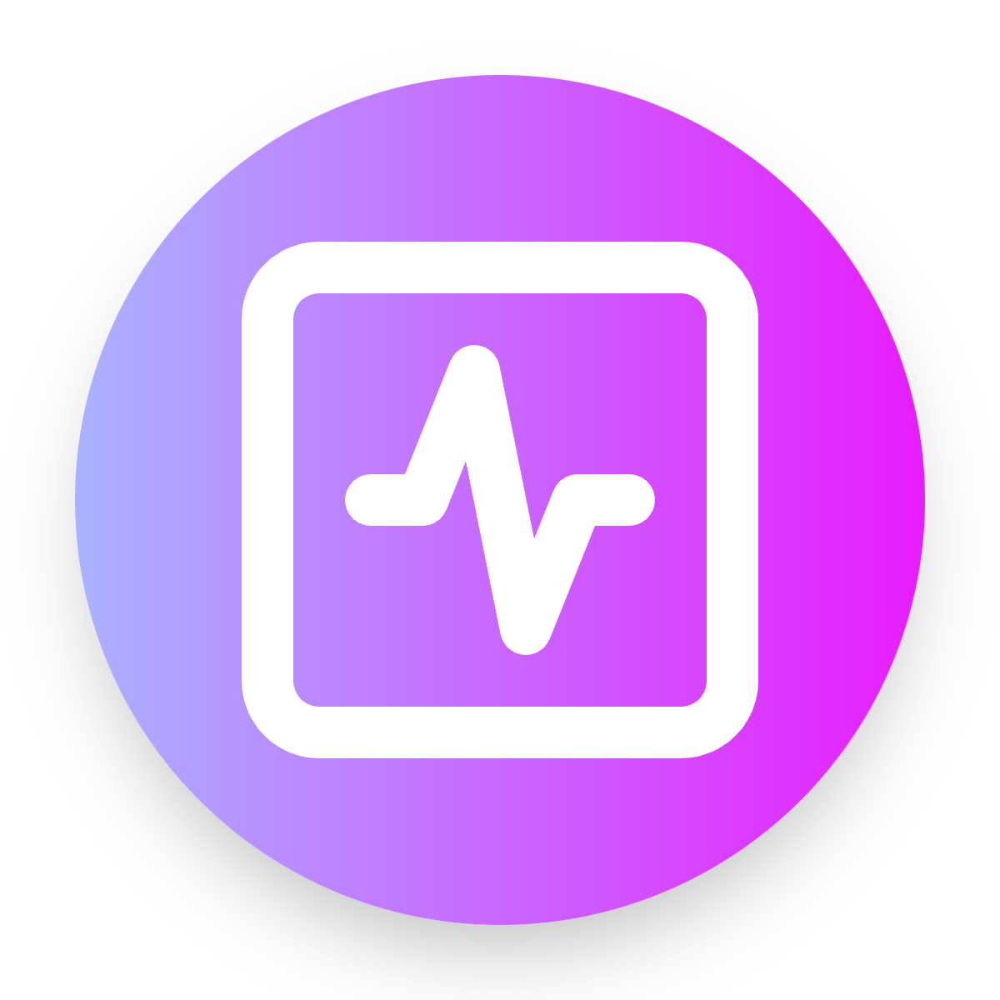

<!-- Improved compatibility of back to top link: See: https://github.com/othneildrew/Best-README-Template/pull/73 -->

<!-- PROJECT LOGO -->
 

  

  <h3 align="center">
    Vibestart
  </h3>
  

    A free, open space for Indian hip-hop artists to join online e-cyphers, share their work, and connect.
     
    <a href="https://github.com/0xsarwagya/vibestart.git"><strong>Check the details »</strong></a>
     
     
    <a href="https://vibestart.xyz?ref=github_repo">View Demo</a>
    ·
    <a href="https://github.com/0xsarwagya/vibestart/issues/new?labels=bug&template=bug_report.md">Report a problem</a>
    ·
    <a href="https://github.com/0xsarwagya/vibestart/issues/new?labels=enhancement&template=feature_request.md">Share an idea</a>
  

